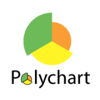

_Last Updated Jan 2022_

Jeeyoung Kim
============

jeeyoungk@gmail.com / [jeeyoungk.com](https://jeeyoungk.com)

Summary
-------

Software Engineer & Engineering Manager.

###  [Plaid](https://plaid.com) (2017-2022)

* (2020) Engineering Manager, Developer Efficiency
  * 3 teams of 20 engineers responsible for the Software Development Lifecycle - CI/CD, Observability, Devleoper Environment, Common Libraries, Monorepos.
  * [Developer Efficiency @ Plaid](https://plaid.com/blog/how-we-built-developer-efficiency-at-plaid/)
  * [Scaling With Devenv](https://plaid.com/blog/scaling-with-devenv/)
* (2018) Tech Lead, Core Services
  * Core backend services powering Plaid's traffic orchestration services.
  * Core maintainer of Plaid's Go monorepo and shared libraries.
* (2017) Data Engineering
  * Version 1 of Plaid's data engineering and analytics platform.

###  [Square](https://squareup.com) (2013-2017)

* (2016) Engineering Manager, Data Engineering
  * Data warehouse, data pipeline, Hadoop modernization.
* (2015) Tech Lead, Data Infrastructure
  * Redshift & Airflow rollout.
* (2014) Tech Lead, Observability
  * Scaling Graphite with a Cassandra-powered time-series backend.
  * Author of the go-to per-service internal dashboard (known as "AppDash").
* (2013) Tech Lead, Payments Infrastructure
  * Scaling Square's infrastructure from a single instance Postgres to a sharded MySQL.

###  [Polychart](https://github.com/Polychart) (2012)

Co-founded a data visualization startup. Modern take of the [Grammar of Graphics / ggplot2](https://en.wikipedia.org/wiki/Ggplot2) on the browser.

### Various Internship Experience

* ContextLogic - now known as [wish.com](https://wish.com) (2011)
* Google (2010)

### Bachelor of Mathematics - University of Waterloo (2012)

Bachelor of Mathematics, Joint Computer Science & Pure Mathematics (co-op)

Graduated with Distinction - Dean's honor list.
